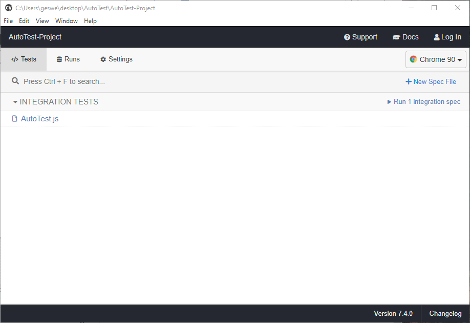
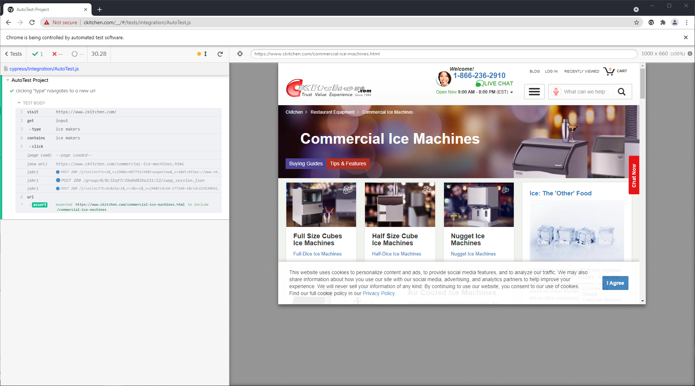

# AutoTest-Project

A simple project to test the search function of ckitchen.com using the query "ice makers". Application uses the [Cypress](https://www.cypress.io/) testing package.

## Requirements

1. [Node](https://nodejs.org/en/)
2. [Git](https://git-scm.com/)

## Setup
1. Clone: `git@github.com:dgeswelli/AutoTest-Project.git`
2. Install: `npm i`

## How to Run Test
1. `npx cypress open`
2. Click `AutoTest.js` in the Cypress Application UI

## Screenshots

